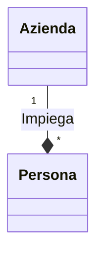
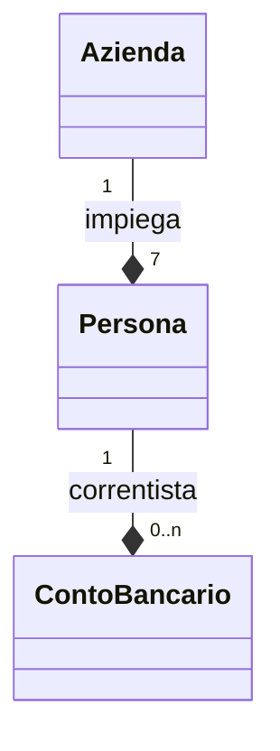
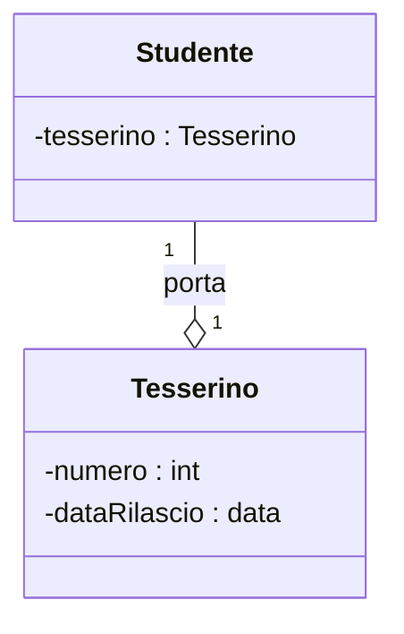
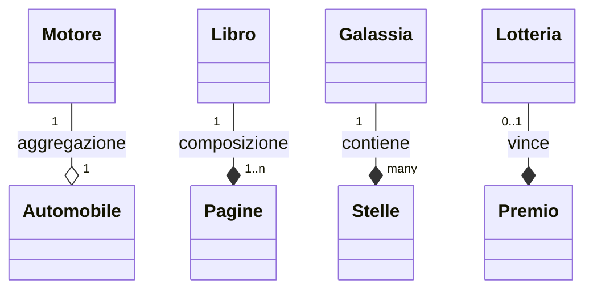

# Analisi e progettazione con UML

Appunti sull'analisi e sulla progettazione di un software

## Introduzione

Lo scopo di questi appunti del testo "UML 2 e Unified Process" è quello di studiare il processo di analisi e progettazione del software utilizzando il Linguaggio di Modellizzazione Unificato (UML) e il Processo Unificato (UP).

Un buon uso dell'UML prevede che questo sia usato per specificare i dettagli di un sistema software. Essendo una parte importante del progetto, i diagrammi UML e i file di specifica che li completano diventano parte integrante del progetto e che deve essere consegnata insieme al prodotto.

## UML

### Cos'è l'UML

L'UML, il Linguaggio di Modellizzazione Unificato, è un linguaggio visuale di modellizzazione di sistemi.

Una caratteristica dei diagrammi UML è la facilità di lettura per un essere umano e la facilità con cui possono essere generati da un computer.

L'UML copre gli aspetti:

- **struttura statica**: i tipi di oggetto e le loro correlazioni necessarie per modellizzare il sistema;

- **comportamento dinamico**: il ciclo di vita e le collaborazioni tra questi oggetti.

### Struttura dell'UML

L'UML è strutturato in tre componenti:

- costituenti fondamentali;
- meccanismi comuni;
- architettura.

### Costituenti fondamentali

- Entità: gli elementi di modellizzazione;
- Relazioni: legano tra di loro le entità;
- diagrammi: viste (prospettive) dei modelli UML che raccontano una storia che riguarda un sistema software; servono per visualizzare cosa farà un sistema (diagramma di analisi) e come lo farà (diagrammi di progettazione).

#### Entità

Le entità sono divise in:

- strutturali: sono i sostantivi di un modello UML, ad esempio classe, intefaccia, collaborazione, caso d'uso, classe attiva, componente, nodo.
- comportamentali: i verbi di un modello UML, ad esempio interazioni e macchina a stati.
- di raggruppamento: il package;
- informative: annotano un modello.

#### Relazioni

Mostrano come due o più entità sono correlate tra loro. Consentono di fissare i legami significativi tra gli elementi.

#### Diagrammi

Il modello è composto da tutte le entità e le relazioni che sono state create per descrivere il sistema software che si vuole progettare. I diagrammi sono viste sul modello.

I diagrammi statici fissano le entità e le relazioni strutturali tra entità.

I diagrammi dinamici fissa il modo in cui le entità interagiscono per generare il comportamento richiesto.

Un diagramma può avere un frame (riquadro), un intestazione e ha un'area di contenuti.

### Riepilogo

- L'UML è un linguaggio di modellizzazione visuale standard.
- La modellizzazione a oggetti vede il mondo come un sistema di oggetti che interagiscono tra di loro. Gli oggetti contengono informazioni e possono eseguire funzioni. I modelli UML hanno:
  - una struttura statica: quali tipi di oggetti sono importanti e come sono in re lazione tra loro:
  - un comportamento dinamico: come gli oggetti collaborano tra loro per ese guire le funzioni richieste al sistema.
- L'UML è composto da costituenti fondamentali:
  - entità:
    - entità strutturali: i sostantivi di un modello UML;
    - entità comportamentali: i verbi di un modello UML;
    - una sola entità di raggruppamento, il package: usato per raggruppare entità semanticamente correlate;
    - una sola entità informativa, l'annotazione, del tutto simile a un post-it,
  - le relazioni collegano le entità tra loro;
  - diagrammi mostrano le viste di interesse di un modello.
- L'UML ha quattro meccanismi comuni:
  - le specifiche sono frasi testuali che descrivono le caratteristiche e la semantica degli elementi modellizzati: il vero contenuto del modello;
  - gli ornamenti sono informazioni aggiunte a un elemento modellizzato in un diagramma per illustrare un qualche concetto aggiuntivo;
  - le distinzioni comuni:
    - classificatore e istanza: classificatore, il concetto astratto di tipo di entità (per esempio un conto bancario); istanza, una specifica istanza di un tipo di entità (per esempio il mio conto bancario);
    - interfaccia e implementazione: l'interfaccia è un contratto che specifica il comportamento di un'entità; l'implementazione specifica invece i dettagli di come tale entità esegue il comportamento;
- meccanismi di estendibilità:
  - vincoli: consentono di aggiungere nuove regole agli elementi modellizzati:
  - stereotipi: introducono nuovi elementi di modellazione basandosi su quelli esistenti;
  - valori etichettati: permettono di aggiungere proprietà agli elementi modellizzati. Un valore etichettato è composto da un'etichetta associata a un valore;
  - un profilo UML è un insieme di vincoli, stereotipi e valori etichettati; consente di personalizzare l'UML per un uso specifico.
- L'UML definisce l'architettura di sistema basandosi su 4+1 viste:
  - vista logica: terminologia e funzionalità del sistema;
  - vista dei processi: efficienza, scalabilità e capacità del sistema;
  - vista di implementazione; assemblaggio del sistema e gestione della configurazione;
  - vista di deployment: topologia, distribuzione, rilascio e installazione del sistema;
  - vista dei casi d'uso: integra le prime quattro viste, descrivendo i requisiti delle parti interessate.

## Unified Process

### Riepilogo

- Un processo di ingegneria del software (Software Engineering Process, SEP) trasforma i requisiti dell'utente in un sistema software, specificando chi fa cosa e quando.
- L'UP ha le sue origini nel lontano 1967. È un SEP maturo, non proprietario, prodotto dagli autori dell'UML.
- L'UP deve essere istanziato per ciascun specifico progetto tramite l'aggiunta di standard interni e di altri strumenti.
- L'UP è un SEP moderno che è:
  - pilotato dai casi d'uso (requisiti) e dai fattori di rischio;
  - incentrato sull'architettura;
  - iterativo e incrementale.
- L'UP prevede la costruzione del software a iterazioni:
- ogni iterazione è simile a un "miniprogetto" che produce una parte del sistema: ciascuna iterazione aggiunge funzioni e valore ai risultati delle precedenti interazioni, in modo da arrivare a costruire il sistema completo finale.
- Ogni iterazione prevede cinque flussi di lavoro fondamentali:
  - requisiti: fissare ciò che il sistema dovrebbe fare;
  - analisi: mettere a punto i requisiti e dar loro struttura;
  - progettazione: concretizzare i requisiti in un'architettura di sistema (definire come il sistema farà quello che deve fare);
  - implementazione: costruire il software;
  - test: verificare che l'implementazione rispetti i requisiti.
- L'UP prevede quattro fasi, ciascuna delle quali si conclude con un'importante milestone:
  - avvio: far decollare il progetto: Obiettivi del Ciclo di Vita;
  - elaborazione: far evolvere l'architettura del sistema: Architettura del Ciclo di Vita;
  - costruzione: costruire il software: Capacità Operativa Iniziale;
  - transizione: rilasciare il software agli utenti: Rilascio del Prodotto.

## Il flusso di lavoro dei requisiti

### Riepilogo

- L'UP prevede che la maggior parte delle attività che riguardano il flusso di lavoro dei requisiti siano effettuate durante le fasi di Avvio e di Elaborazione del ciclo di vita di un progetto.
- Il meta-modello dei requisiti mostra che esistono due modi per fis sare i requisiti: come requisiti funzionali e non-funzionali oppure come casi d'uso e attori.
- Nell'UP il dettaglio del flusso di lavoro dei requisiti prevede le seguenti attività che interessano in qualità di analisti e progettisti:
  - individuare attori e casi d'uso;
  - descrivere un caso d'uso;
  - strutturare il modello dei casi d'uso.
- Il flusso di lavoro dei requisiti standard dell'UP si estende con:
  - attore: Ingegnere dei requisiti;
  - attività: Individuare requisiti funzionali;
  - attività: Individuare requisiti non-funzionali;
  - attività: Assegnare priorità ai requisiti;
  - attività: Estrarre i casi d'uso dai requisiti.
- La maggior parte dei progetti fallisce per problemi di ingegneria dei requisiti.
- Esistono due tipi di requisiti:
  - requisiti funzionali: il comportamento che il sistema dovrebbe avere;
  - requisiti non-funzionali: proprietà o vincoli specifici del sistema.
- I requisiti ben formulati dovrebbero essere espressi in italiano semplice e strutturato, utilizzando affermazioni standard, in modo che possano essere facilmente interpretati dagli strumenti di ingegneria dei requisiti.
  - <id> <sistema> dovrà <funzione>
- Il modello dei requisiti contiene i requisiti funzionali e non-funzionali di un sistema. Può trattarsi di:
  - un documento;
  - un database gestito da uno strumento di gestione dei requisiti. I requisiti posssono essere organizzati in una tassonomia: una gerarchia di tipi di requisiti che divide i requisiti in categorie.
- I requisiti possono avere alcuni attributi: informazioni aggiuntive (meta-dati) as sociate a ogni requisito:
  - per esempio, priorità: MOSCOW (Must have. Should have, Could have, Want to have);
  - per esempio, gli attributi RUP (Stato, Vantaggi, Sforzo, Rischio, Stabilità, VersioneDestinazione);
  - mantenere gli attributi dei requisiti al minimo indispensabile per avvantaggia re il progetto. one
- La mappa non è il territorio. Il linguaggio naturale contiene:
  - rimozioni: informazioni scartate;
  - distorsioni: informazioni modificate;
  - generalizzazioni: informazioni incorporate in regole, assiomi o principi che riguardano i concetti di verità e falsità.
- I quantificatori universali (per esempio, "tutto", "ogni") possono indicare il li mite della mappa mentale dell'interlocutore e li si dovrebbe sempre mettere in discussione.
- Tecniche per individuare i requisiti:
  - interviste;
  - questionari;
  - workshop.

## Associazioni

### Cos'è un'associazione?

Le associazioni sono connessioni semantiche significative tra elementi di modellizzazione, che nel nostro caso sono rappresentati da classi o entità.

Per ottenere una base di dati che funzioni le entità non possono essere lasciate isolate ma occorre connetterle tra loro affinché si possano ottenere informazioni utili.

### Sintassi per rappresentare le associazioni

Le associazioni possono essere indicate con:

- un nome dell'associazione;
- un nome dei ruoli;
- molteplicità;
- navigabilità (che nel caso delle basi di dati è sempre simmetrica).

#### Esempio

#### Nomi delle associazioni

I nomi delle associazioni dovrebbero essere verbi o frasi verbali poiché solitamente indicano un'azione.

I nomi delle associazioni sono scritte in [lowerCaseCamel](https://it.wikipedia.org/wiki/Notazione_a_cammello) iniziando con una lettera minuscola. I nomi delle classi in UpperCaseCamel inizinado con una lettera maiuscola.
Nella scelta del nome il criterio è quello di semplificare la lettura del diagramma.

#### Molteplicità

La molteplicità limita il numero di oggetti che possono partecipare in una relazione in un dato istante.

Nell'esempio, `Persona` è impiegata in esattamente 1 `Azienda` in un dato istante. In un istante diverso potrebbe essere impiegata di un'azienda diversa. La molteplicità di `Persona` nell'associazione `impiega` esprime due vincoli:

- un istanza (riga della tabella) di `Persona` può essere impiegata in una sola `Azienda` alla volta;
- le istanze di `Persona` devono sempre essere impiegate di un'`Azienda`.

La molteplicità viene indicata come intervalli nella forma `minimo..massimo` dove `minimo` e `massimo` sono numeri naturali (0, 1...) oppure espressioni che indicano un valore intero.

#### Esempio

Il diagramma esprime i seguenti vincoli:

- Un'`Azienda` deve impiegare esattamente 7 istanze di `Persona`;
- una `Persona` deve essere impiegata esattamente in una `Azienda`;
- non posso rappresentare persone non impiegate;
- una `Persona` può essere correntista di più `ContoBancario`;
- un `ContoBancario` ha come correntista esattamente una `Persona`.

#### Esempi vari

