# Gestione informatizzata di una palestra (Esame di Stato M733/2005)

> 📝 Il testo è disponinibile nell'[archivio del Ministero dell'Istruzione](https://www.istruzione.it/esame_di_stato/Secondo_Ciclo/tracce_prove_scritte/2005/tecnica/M733.pdf)

## Descrizione del problema

Una palestra vuole informatizzare la gestione dei **corsi** _offerti_ alla propria **clientela** che si caratterizzano per:

- la presenza di **istruttori** _specializzati_ in ciascun corso;
- il numero massimo di **partecipanti** variabile per ciascun corso;
- l’**offerta** dello stesso corso in diversi **orari** della giornata;
- la _partecipazione_ al corso con idoneo certificato medico di durata annuale.

Organizzare un database in grado di fornire le seguenti informazioni:

1. elenco degli iscritti a ogni corso
2. numero dei posti liberi in ciascun corso
3. elenco dei corsi tenuti da ogni istruttore
4. elenco dei clienti con certificato medico scaduto e,

dopo aver

- descritto le caratteristiche dell’applicativo che si intende utilizzare,
- elaborato il progetto dell’applicazione complessiva, comprendente l’analisi, lo schema, la definizione dei dati e il menu di scelta,

realizzare almeno uno dei quattro punti sopra indicati utilizzando l’applicativo descritto.

Progettare, infine, la pagina web con la quale la palestra presenta alla clientela i corsi, le relative caratteristiche e gli orari.

Dati mancanti opportunamente scelti.

## Soluzione

### Glossario di progetto

| Termine          | Descrizione                                               | Sinonimi                     | Omonimi | Termini correlati             |
| ---------------- | --------------------------------------------------------- | ---------------------------- | ------- | ----------------------------- |
| Partecipante     | Una persona che frequenta la palestra                     | clientela, cliente, iscritto |         |                               |
| Istruttore       | Una persona che impartisce uno o più corsi                |                              |         |
| Corso            | Corso che la palestra intende offrire                     |                              | offerta | Istruttore, Offerta           |
| Corso offerto    | Un corso in un certo orario impartito da un istruttore    |                              | corso   | Corso, Istruttore, Cliente    |
| Orario           | Periodo durante il quale un corso offerto viene impartito |                              |         | Corso Offerto                 |
| Partecipazione   | La partecipazione di un partecipante ad un corso offerto  | iscrizione                   |         | partecipante, corso offertoId |
| Specializzazione | Abilitazione di un istruttore per impartire un corso      |                              |         | istruttore, corso             |

### Definizione delle specifiche

#### Casi d'uso

```plantuml
@startuml
left to right direction

title Casi d'uso

actor GestoreCorsi
actor Utente

rectangle SoftwarePalestra {
 rectangle FunzionalitàDataBase {
  usecase (Elenco degli iscritti a ogni corso) as p1
  usecase (Numero dei posti liberi in ciascun corso) as p2
  usecase (Elenco dei corsi tenuti da ogni istruttore) as p3
  usecase (Elenco dei clienti con certificato medico scaduto) as p4
 }

 rectangle FunzionalitàWeb {
  usecase (Visualizza informazioni corsi) as w1
  usecase (Visualizza dettagli corso) as w2
  usecase (Visualizza orario) as w3
 }
}

GestoreCorsi --> FunzionalitàDataBase

Utente --> w1
w1 ..> w2 : include
w1 ..> w3 : include
w1 ..> p2 : include
@enduml
```

### Requisiti

#### Database

```mermaid
requirementDiagram

requirement requisiti_database {
    id: 1
    text: Il database dovrà essere completo rispetto alle funzionalità richieste.
    risk: high
    verifymethod: inspection
}

functionalRequirement elenco_iscritti  {
 id: 1.1
 text: Il sistema dovrà visualizzare l'elenco degli iscritti a ogni corso.
 verifymethod: inspection
}

functionalRequirement posti_liberi {
    id: 1.2
    text: Il sistema dovrà visualizzare i posti liberi per ciascun corso
    verifyMethod: test
}

functionalRequirement corsi_per_istruttore {
    id: 1.3
    text: Il sistema dovrà visualizzare l'elenco dei corsi per ciascun istruttore
    verifyMethod: test
}

functionalRequirement certificati_scaduti {
    id: 1.4
    text: Il sistema dovrà visualizzare l'elenco dei clienti con certificato medico scaduto
    verifyMethod: test
}

 requisiti_database - contains -> elenco_iscritti
 requisiti_database - contains -> posti_liberi
 requisiti_database - contains -> corsi_per_istruttore
 requisiti_database - contains -> certificati_scaduti
```



#### Sito web

```mermaid
requirementDiagram

requirement sito_web {
    id: 2
    text: Il sito web dovrà presentare alla clientela i corsi, le relative caratteristiche e gli orari.
    verifyMethod: test
}

functionalRequirement web_elenco_corsi {
    id: 2.1
    text: Il sito web dovrà visualizzare l'elenco dei corsi
    verifyMethod: test
}

functionalRequirement web_dettagli_corso {
    id: 2.2
    text: Il sito web dovrà visualizzare la descrizione del corso selezionato
    verifyMethod: test
}

functionalRequirement web_orario_corso {
    id: 2.3
    text: Il sito web dovrà visualizzare l'orario del corso selezionato
    verifyMethod: test
}

sito_web - contains -> web_elenco_corsi
sito_web - contains -> web_dettagli_corso
sito_web - contains -> web_orario_corso
```

### Analisi

#### Diagramma delle classi di analisi

#### Vista delle classi per la specifica elenco_iscritti


- Un partecipante può partecipare a più corsi offerti.
- Un corso può avere più partecipanti
- Un corso offerto si riferisce ad un solo corso
- Un corso può essere offerto zero o più volte

#### Vista delle classi per la specifica posti_liberi


- Si suppone che ogni corso offerto possa indicare un numero massimo di partecipanti

> 📝 La scelta di inserire l'attributo sul numero di massimo di partecipanti in CorsoOfferto piuttosto che in corso è arbitraria e non indicata nel testo. Si suppone che il numero di posti possa variare anche per lo stesso corso.

#### Vista delle classi per la specifica corsi_per_istruttore


- Un istruttore impartisce zero o più corsi offerti per cui è specializzato
- Un corso offerto ha esattamente un istruttore
- Un istruttore è specializzato in almeno un corso
- Un corso può avere molti istruttori che vi sono specializzati

#### Vista delle classi per la specifica certificati_scaduti


- Un partecipante ha un solo certificato memorizzato nel sistema

#### Vista delle classi per la specifica web_dettagli_corso


#### Vista delle classi per la specifica web_orario_corso


#### Integrazione delle viste


### Progettazione

#### Diagramma delle classi di progettazione


#### Diagramma entità relazioni


#### Diagramma entità relazioni - con commenti


#### Schema delle relazioni

`Partecipante` (
**partecipanteId**: INTEGER
, nome: TEXT
, cognome: TEXT
)

`Istruttore` (
**istruttoreId**: INTEGER
, nome: TEXT
, cognome: TEXT
)

`Corso` (
**corsoId**: INTEGER
, denominazione: TEXT
, descrizione: TEXT
)

`CorsoOfferto` (
**corsoOffertoId**: INTEGER
, _corsoId_: INTEGER -> Corso(corsoId)
, _istruttoreId_: INTEGER -> Istruttore(istruttoreId)
, numeroMassimoPartecipanti: INTEGER
, descrizione: TEXT
, inizio: TEXT
, fine: TEXT
)

`Giorno` (
**giorno_id**: INTEGER
, giorno: TEXT
, abbreviazione: TEXT
)

`Orario` (
**_corsoOffertoId_**: INTEGER -> CorsoOfferto(corsoOffertoId)
, **_giornoId_**: INTEGER -> Giorno(giorno_id)
, **inizio**: TEXT
, fine: TEXT
, sala: TEXT
)

`Partecipazione` (
**_partecipanteId_**: INTEGER -> Partecipante(partecipanteId)
, **_corsoOffertoId_**: INTEGER -> CorsoOfferto(corsoOffertoId)
, dataRilascioCertificato: TEXT
, dataScadenzaCertificato: TEXT
)

`Specializzazione` (
**_istruttoreId_**: INTEGER -> Istruttore(IstruttoreId)
, **_corsoId_**: INTEGER -> Corso(corsoId)
)

## Realizzazione

### Schema in SQL

```sql
CREATE TABLE Partecipante
        -- Un partecipante
(
  partecipanteId INTEGER
     PRIMARY KEY,       -- Chiave surrogata
  nome TEXT NOT NULL,   -- Nome del cliente
  cognome TEXT NOT NULL -- Cognome del cliente
);

CREATE TABLE Istruttore
        -- Un istruttore
(
  istruttoreId INTEGER
     PRIMARY KEY,       -- Chiave surrogata
  nome TEXT NOT NULL,   -- Nome dell'istruttore
  cognome TEXT NOT NULL -- Cognome dell'istruttore
);

CREATE TABLE Corso
        -- Un tipo di corso
(
  corsoId INTEGER
     PRIMARY KEY,              -- Chiave surrogata
  denominazione TEXT NOT NULL, -- Nome del corso
  descrizione TEXT NOT NULL    -- Descrizione del corso da visualizzare sul sito web
);

CREATE TABLE CorsoOfferto
         -- Le diverse offerte della palestra
(
  corsoOffertoId INTEGER
     PRIMARY KEY,                         -- Chiave surrogata
  corsoId INTEGER
     REFERENCES Corso(corsoId),           -- Riferimento al tipo di corso
  istruttoreId INTEGER
     REFERENCES Istruttore(istruttoreId), -- Riferimento all'istruttore che impartisce il corso
  numeroMassimoPartecipanti INTEGER
     DEFAULT 10,                          -- Numero massimo di partecipanti al corso
  descrizione TEXT,                       -- Descrione del corso offerto
  inizio TEXT NOT NULL,                   -- Data della prima lezione del corso in formato ISO 8601
  fine TEXT NOT NULL,                     --   Data dell'ultima lezione del corso in formato ISO 8601
  CHECK (length(inizio) = 10 AND inizio LIKE '____-__-__'),
  CHECK (length(inizio) = 10 AND inizio LIKE '____-__-__'),
  CHECK ((fine IS NULL) OR (fine > inizio)),
  CHECK (numeroMassimoPartecipanti > 0)
);

CREATE TABLE Giorno
        -- Enumerazione dei giorni della settimana
(
  giorno_id INTEGER
     PRIMARY KEY,             -- chiave surrogata
  giorno TEXT NOT NULL,       -- nome del giorno della settimana
  abbreviazione TEXT NOT NULL -- nome abbreviato del giorno della settimana
);

CREATE TABLE Orario
        -- L'orario in cui si svolge una lezione
(
  corsoOffertoId INTEGER
     REFERENCES CorsoOfferto(corsoOffertoId), -- Riferimento al corso offerto
  giornoId INTEGER
     REFERENCES Giorno(giorno_id),            -- Giorno della settimana
  inizio TEXT,                                -- Ora di inizio
  fine TEXT NOT NULL,                         -- Ora di fine
  sala TEXT,                                  -- Sala dove si tiene il corso
  PRIMARY KEY (corsoOffertoId, giornoId, inizio),
  CHECK (length(inizio) = 5 AND inizio LIKE '__:__'),
  CHECK (length(fine) = 5 AND fine LIKE '__:__'),
  CHECK (fine > inizio)
);

CREATE TABLE Partecipazione
          -- La relazione molti a molti tra partecipanti e corsi offerti
(
  partecipanteId INTEGER
     REFERENCES Partecipante(partecipanteId), -- Riferimento al partecipante
  corsoOffertoId INTEGER
     REFERENCES CorsoOfferto(corsoOffertoId), -- Riferimento al corso offerto, PK
  dataRilascioCertificato TEXT NOT NULL,      -- Data di rilascio del certificato medico
  dataScadenzaCertificato TEXT,               -- Data di scadenza del certificato medico
  PRIMARY KEY (partecipanteId, corsoOffertoId),
  CHECK (length(dataRilascioCertificato) = 10 AND dataRilascioCertificato LIKE '____-__-__'),
  CHECK (length(dataScadenzaCertificato) = 10 AND dataScadenzaCertificato LIKE '____-__-__'),
  CHECK ((dataScadenzaCertificato IS NULL) OR (dataScadenzaCertificato > dataRilascioCertificato))
);

CREATE TABLE Specializzazione
          -- La relazione molti a molti tra istruttori e specializzazioni
(
  istruttoreId INTEGER
     REFERENCES Istruttore(IstruttoreId), -- Riferimento allo istruttore
  corsoId INTEGER
     REFERENCES Corso(corsoId),           -- Riferimento al corso
  PRIMARY KEY (istruttoreId, corsoId)
);
```

## Verifica

### Specifica 1.1 Query sul database

```sql
CREATE view elenco_iscritti AS
SELECT p.nome, p.cognome, o.descrizione, c.denominazione
FROM
 Partecipante AS p
  INNER JOIN Partecipazione USING (partecipanteId)
  INNER JOIN CorsoOfferto AS o USING (corsoOffertoId)
  INNER JOIN Corso AS c USING (corsoId);
```

### Specifica 1.2 Query sul database

```sql
CREATE view posti_liberi AS
SELECT o.numeroMassimoPartecipanti - COUNT(p.partecipanteId) AS posti_liberi, o.descrizione, c.denominazione
FROM
 Partecipante AS p
  INNER JOIN Partecipazione USING (partecipanteId)
  INNER JOIN CorsoOfferto AS o USING (corsoOffertoId)
  INNER JOIN Corso AS c USING (corsoId)
GROUP BY o.corsoOffertoId;
```

### Specifica 1.3 Query sul database

```sql
CREATE view corsi_per_istruttore AS
SELECT i.nome, i.cognome, o.descrizione, c.denominazione
FROM
 CorsoOfferto AS o
  INNER JOIN Corso AS c USING (corsoId)
  INNER JOIN Istruttore i USING (istruttoreId)
ORDER BY i.cognome, i.nome, c.denominazione, o.descrizione;
```

### Specifica 1.4 - Query sul database

```sql
CREATE VIEW certificati_scaduti AS
SELECT p.cognome, p.nome, c.denominazione, dataRilascioCertificato,
  CASE
    -- se la data di scadenza è nota allora quella
    WHEN dataScadenzaCertificato IS NOT NULL
      THEN dataScadenzaCertificato
      ELSE
     -- un anno dopo il rilascio
       date(julianday(dataRilascioCertificato) + 365.25)
  END AS giornoScadenza
FROM Partecipante AS p
 INNER JOIN Partecipazione USING (partecipanteId)
 INNER JOIN CorsoOfferto USING (corsoOffertoId)
 INNER JOIN Corso AS c USING (corsoId)
WHERE date() > giornoScadenza;
```
