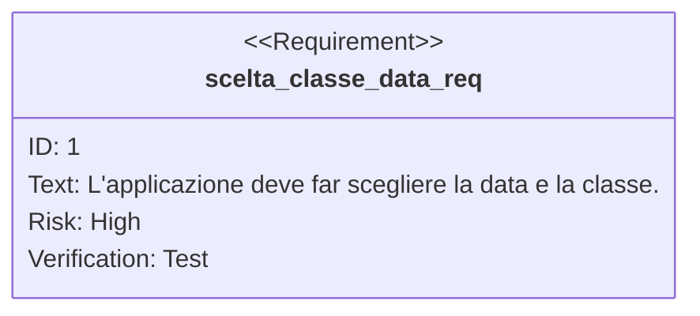
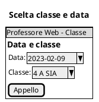
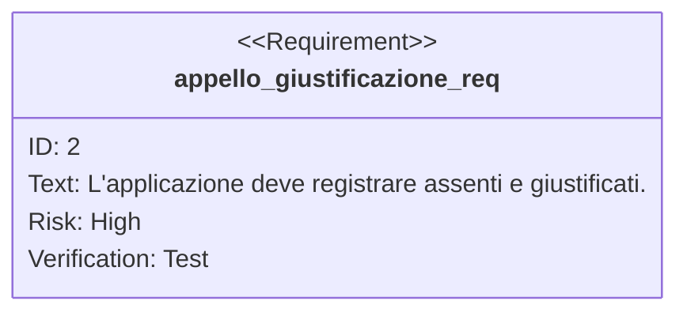
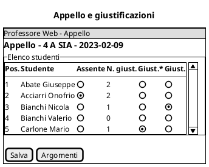
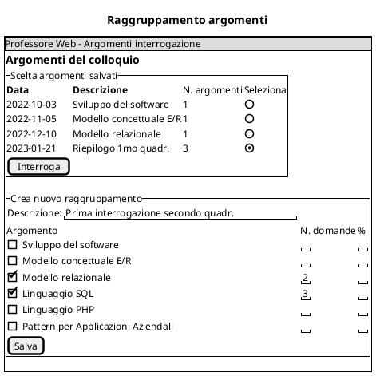
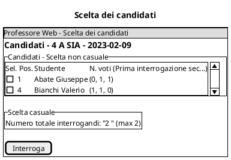
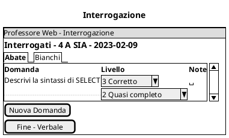
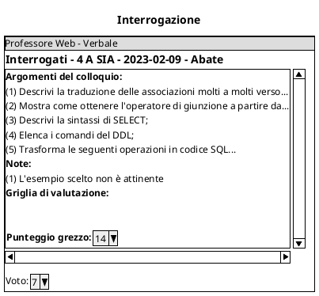

# Prove orali: interrogazioni nella scuola delle griglie

## Descrizione sommaria del software e delle necessità dell'utente

### Il dominio applicativo (contesto)

Il prof. Loquenzo Orali, chiarissimo e rigorosissimo prof. di informatica, usa un suo particolare metodo didattico.

All'inizio della lezione del giorno $d$ nella classe $c$ egli fa l'appello e, ad ogni studente presente chiede se si avvale della giustificazione per non essere interrogato in quel giorno; in caso positivo lo annota in $G_{cd}$.

Considera due tipi di giustificazioni:

- quelle che non devono essere motivate, che sono $g_{cq}$ per quadrimestre, e
- quelle dovute alle eventuali attività previste dal Piano Formativo Personalizzato, dal Piano Didattico Personalizzato e da impegni istituzionali (es: attività di orientamento, competizioni scolastiche...).

Il prof. sceglie un sottoinsieme di argomenti $A_{ci}$ oggetto di interrogazione fra gli argomenti $A_c$ programmati per la classe e inserisce, alternativamente, o il numero o la percentuale di domande per argomento. Per ogni argomento ci sono un insieme $D_{a}$ di $|D_{a}|$ domande predefinite. Individua, quindi, gli studenti $I_{ci}$ già interrogati almeno una volta su tutti gli argomenti $A_{ci}$.

Considerati gli studenti candidati all'interrogazione $C_{cd} = S_c \setminus \bar{P}_{cd} \setminus G_{cd} \setminus I_{ca}$, dove $S_c$ sono gli studenti della classe, $\bar{P}_{cd}$ sono gli assenti nel giorno $d$ e $G_{cd}$ quelli giustificati, decide di interrogare $n$ studenti, dove $n \leq C_{ca}$.

Per ognuno degli $n$ interrogandi estrae un numero casuale $r$, controlla che lo studente che è iscritto nella posizione $r$ del registro di classe sia tra i candidati all'interrogazione $C_{cd}$. Se lo è, lo include nell'elenco degli interrogati $Q_{cd}$, altrimenti scorre le posizioni in avanti finché non trova uno studente che può essere interrogato $s \in C_{cd}$, e lo aggiunge alla lista $Q_{cd}$.

Il prof. interroga gli studenti ponendo un quesito al primo studente estratto, poi un altro quesito secondo e così via. Giunto all'ultimo interrogando, ricomincia dal primo.

Per determinare il quesito dell'interrogazione, seleziona l'argomento in accordo ai criteri sopra stabiliti ed estrae un numero casuale $1 \leq |D_{a}|$. Se il quesito è già stato già estratto nel giorno $E_{cg}$, allora cerca la prima domanda successiva che non sia stata già posta.

La prova orale termina dopo che ogni interrogato è stato ascoltato su di un numero prestabilito di domande, uguale per tutti.

[//]: Mentre lo studente colloquia col professore, quest'ultimo annota domanda e commenti sulla risposta quindi formula un giudizio inserendo una sequenza di valori numerici, detti livelli, compresi tra 0 e 10.

Il prof. valuta la prova orale usando delle griglie di valutazione imposte dal dipartimento. Le griglie sono strutture a due livelli, detti indicatore e descrittore. Ad ogni indicatore sono associati un sottoinsieme di descrittori ed un peso. Il descrittore è proprio dell'indicatore e indica la qualità della prestazione analizzata insieme ad un livello. Il peso è un numero frazionario mentre il livello è un numero naturale. Il punteggio grezzo è la combinazione lineare dei pesi con i livelli corrispondenti.

La griglia del dipartimento realizzata con i seguenti indicatori: correttezza (i concetti devono essere espressi in accordo al loro significato), completezza (tutte le idee semplici del concetto devono essere esposte), pertinenza (i concetti devono essere quelli richiesti dal quesito e non altri), minimalità (l'esposizione non deve essere ridondante), intelligibilità (i concetti devono essere espressi in modo comprensibile, senza necessità di ulteriori quesiti aggiuntivi), appropriatezza del lessico (i concetti devono fare riferimento al lessico settoriale e non devono essere scelti in modo casuale). Pesi, indicatori e livelli sono in tabella:

| Correttezza (peso 1)                                                                                                         |                                                                                                                     |                                                                                                                                                        |                                                                                                                                  |                                                                                                                   |
| ---------------------------------------------------------------------------------------------------------------------------- | ------------------------------------------------------------------------------------------------------------------- | ------------------------------------------------------------------------------------------------------------------------------------------------------ | -------------------------------------------------------------------------------------------------------------------------------- | ----------------------------------------------------------------------------------------------------------------- |
| I concetti devono essere espressi in accordo al loro significato nel rispetto della grammatica del linguaggio di descrizione |                                                                                                                     |                                                                                                                                                        |                                                                                                                                  |                                                                                                                   |
|                                                                                                                              | 3                                                                                                                   | 2                                                                                                                                                      | 1                                                                                                                                | 0                                                                                                                 |
|                                                                                                                              | Corretto                                                                                                            | Parzialmente corretto                                                                                                                                  | Scarsamente corretto                                                                                                             | Non corretto                                                                                                      |
|                                                                                                                              | I concetti sono espressi in accordo al loro significato nel rispetto della grammatica del linguaggio di descrizione | La maggior parte dei concetti sono espressi in accordo al loro significato nel rispetto della grammatica del linguaggio di descrizione                 | I concetti non sono espressi in accordo al loro significato o non è stata rispettata la grammatica del linguaggio di descrizione | I concetti non sono in accordo al loro significato e la grammatica del linguaggio di descrizione non è rispettata |
| Completezza (peso 1)                                                                                                         |                                                                                                                     |                                                                                                                                                        |                                                                                                                                  |                                                                                                                   |
| Tutte le idee semplici del concetto devono essere esposte e devono potersi creare delle relazioni tra concetti               |                                                                                                                     |                                                                                                                                                        |                                                                                                                                  |                                                                                                                   |
|                                                                                                                              | 3                                                                                                                   | 2                                                                                                                                                      | 1                                                                                                                                | 0                                                                                                                 |
|                                                                                                                              | Completo                                                                                                            | Quasi completo                                                                                                                                         | Poco completo                                                                                                                    | Incompleto                                                                                                        |
|                                                                                                                              | Tutte le idee semplici sono esposte ed è possibile stabilire tutte le relazioni tra esse                            | La maggior parte delle idee semplici sono esposte ed è possibile stabilire la maggior parte delle relazioni tra esse                                   | Solo poche delle idee semplici sono esposte o non è sempre possibile stabilire le relazioni tra esse                             | Poche idee semplici sono esposte e non è possibile stabilire relazioni tra esse                                   |
| Pertinenza (peso 0.5)                                                                                                        |                                                                                                                     |                                                                                                                                                        |                                                                                                                                  |                                                                                                                   |
| I concetti devono essere quelli richiesti dal quesito e non altri                                                            |                                                                                                                     |                                                                                                                                                        |                                                                                                                                  |                                                                                                                   |
|                                                                                                                              | 2                                                                                                                   | 1                                                                                                                                                      | 0                                                                                                                                |                                                                                                                   |
|                                                                                                                              | Pertinente                                                                                                          | Poco pertinente                                                                                                                                        | Non pertinente                                                                                                                   |                                                                                                                   |
|                                                                                                                              | I concetti sono tutti e soli quelli richiesti dal quesito                                                           | Vi sono concetti non richiesti dal quesito o vi sono solo un sottoinsieme proprio dei concetti richiesti                                               | Non vi sono i concetti richiesti                                                                                                 |                                                                                                                   |
| Minimalità (peso 0.5)                                                                                                        |                                                                                                                     |                                                                                                                                                        |                                                                                                                                  |                                                                                                                   |
| L'esposizione non deve essere ridondante                                                                                     |                                                                                                                     |                                                                                                                                                        |                                                                                                                                  |                                                                                                                   |
|                                                                                                                              | 2                                                                                                                   | 1                                                                                                                                                      | 0                                                                                                                                |                                                                                                                   |
|                                                                                                                              | Minimale                                                                                                            | Poco ridondante                                                                                                                                        | Ridondante                                                                                                                       |                                                                                                                   |
|                                                                                                                              | L'esposizione non presenta ridondanze                                                                               | L'esposizione include delle ridondanze che potrebbero essere unificate ma che sono funzionali ad una descrizione di particolarizzazioni di un concetto | L'esposizione è ridondante                                                                                                       |                                                                                                                   |
| Intelligibilità (peso 0.5)                                                                                                   |                                                                                                                     |                                                                                                                                                        |                                                                                                                                  |                                                                                                                   |
| I concetti sono espressi in modo comprensibile, senza necessità di ulteriori quesiti aggiuntivi                              |                                                                                                                     |                                                                                                                                                        |                                                                                                                                  |                                                                                                                   |
|                                                                                                                              | 2                                                                                                                   | 1                                                                                                                                                      | 0                                                                                                                                |                                                                                                                   |
|                                                                                                                              | Intelligibile                                                                                                       | Poco intelligibile                                                                                                                                     | Non intelligibile                                                                                                                |                                                                                                                   |
|                                                                                                                              | Il concetto è esposto in modo facilmente comprensibile e non richiede ulteriori quesiti                             | Il concetto è esposto in modo non facilmente comprensibile o richiede ulteriori quesiti                                                                | Il concetto è esposto in modo non facilmente comprensibile e richiede ulteriori quesiti                                          |                                                                                                                   |
| Appropriatezza del lessico (peso 0.5)                                                                                        |                                                                                                                     |                                                                                                                                                        |                                                                                                                                  |                                                                                                                   |
| I concetti devono fare riferimento al lessico settoriale e non devono essere scelti in modo casuale                          |                                                                                                                     |                                                                                                                                                        |                                                                                                                                  |                                                                                                                   |
|                                                                                                                              | 2                                                                                                                   | 1                                                                                                                                                      | 0                                                                                                                                |                                                                                                                   |
|                                                                                                                              | Appropriato                                                                                                         | Poco appropriato                                                                                                                                       | Non appropriato                                                                                                                  |                                                                                                                   |
|                                                                                                                              | Il lessico usato è quello settoriale                                                                                | La maggior parte dei concetti è espressa nei termini del linguaggio settoriale                                                                         | La scelta dei termini è casuale                                                                                                  |                                                                                                                   |

Al termine dell'interrogazione, il prof. registra un voto, che è l'arrotondamento al multiplo di 0,5 più vicino alla media ponderata dei livelli, e un resoconto (verbale) dell'interrogazione.

## Lavoro e consegne

1. Determinare i requisiti funzionali dell'applicazione web che aiuta il professore nello svolgimento del suo lavoro; specificarli.
2. Fornire un glossario di progetto.
3. Analizzare le entità e le relazioni presenti nel domino del problema; fornire un diagramma delle classi di analisi.
4. Progettare una base di dati per risolvere il problema; fornire lo schema dei dati e il codice SQL per la creazione della base di dati.
5. Progettare l'interfaccia dell'applicazione web.
6. Fornire le query da utilizzare nell'applicazione web.

## Requisiti

### Scelta della classe e della data

### Appello e giustificazioni

### Scelta degli argomenti

### Scelta dei candidati

### Gestione domande

### Verbale

