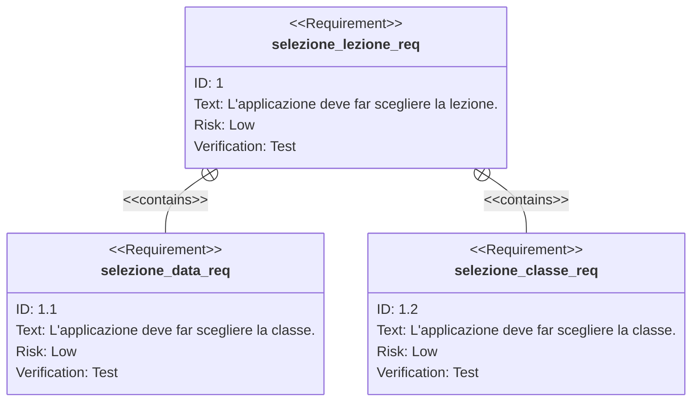

# Prove orali: interrogazioni al tempo delle griglie

[toc]{type: "ol", level: [1,2,3]}

## Descrizione sommaria del software e delle necessità dell'utente

### Il dominio applicativo (contesto)

Il prof. Loquenzo Orali, chiarissimo e rigorosissimo prof. di informatica, usa un suo particolare metodo didattico.

All'inizio della lezione del giorno $d$ nella classe $c$ egli fa l'appello e, ad ogni studente presente chiede se si avvale della giustificazione per non essere interrogato in quel giorno; in caso positivo lo annota in $G_{cd}$.

Considera due tipi di giustificazioni:

- quelle che non devono essere motivate, che sono $g_{cq}$ per quadrimestre, e
- quelle dovute alle eventuali attività previste dal Piano Formativo Personalizzato, dal Piano Didattico Personalizzato e da impegni istituzionali (es: attività di orientamento, competizioni scolastiche...).

Il prof. sceglie un sottoinsieme di argomenti $A_{ci}$ oggetto di interrogazione fra gli argomenti $A_c$ programmati per la classe e inserisce, alternativamente, o il numero o la percentuale di domande per argomento. Per ogni argomento ci sono un insieme $D_{a}$ di $|D_{a}|$ domande predefinite. Individua, quindi, gli studenti $I_{ci}$ già interrogati almeno una volta su tutti gli argomenti $A_{ci}$.

Considerati gli studenti candidati all'interrogazione $C_{cd} = S_c \setminus \bar{P}_{cd} \setminus G_{cd} \setminus I_{ca}$, dove $S_c$ sono gli studenti della classe, $\bar{P}_{cd}$ sono gli assenti nel giorno $d$ e $G_{cd}$ quelli giustificati, decide di interrogare $n$ studenti, dove $n \leq C_{ca}$.

Per ognuno degli $n$ interrogandi estrae un numero casuale $r$, controlla che lo studente che è iscritto nella posizione $r$ del registro di classe sia tra i candidati all'interrogazione $C_{cd}$. Se lo è, lo include nell'elenco degli interrogati $Q_{cd}$, altrimenti scorre le posizioni in avanti finché non trova uno studente che può essere interrogato $s \in C_{cd}$, e lo aggiunge alla lista $Q_{cd}$.

Il prof. interroga gli studenti ponendo un quesito al primo studente estratto, poi un altro quesito secondo e così via. Giunto all'ultimo interrogando, ricomincia dal primo.

Per determinare il quesito dell'interrogazione, seleziona l'argomento in accordo ai criteri sopra stabiliti ed estrae un numero casuale $1 \leq |D_{a}|$. Se il quesito è già stato già estratto nel giorno $E_{cg}$, allora cerca la prima domanda successiva che non sia stata già posta.

La prova orale termina dopo che ogni interrogato è stato ascoltato su di un numero prestabilito di domande, uguale per tutti.

Il prof. valuta la prova orale usando delle griglie di valutazione imposte dal dipartimento. Le griglie sono strutture a due livelli, detti indicatore e descrittore. Ad ogni indicatore sono associati un sottoinsieme di descrittori ed un peso. Il descrittore è proprio dell'indicatore e indica la qualità della prestazione analizzata insieme ad un livello. Il peso è un numero frazionario mentre il livello è un numero naturale. Il punteggio grezzo è la combinazione lineare dei pesi con i livelli corrispondenti.

La griglia del dipartimento realizzata con i seguenti indicatori: correttezza (i concetti devono essere espressi in accordo al loro significato), completezza (tutte le idee semplici del concetto devono essere esposte), pertinenza (i concetti devono essere quelli richiesti dal quesito e non altri), minimalità (l'esposizione non deve essere ridondante), intelligibilità (i concetti devono essere espressi in modo comprensibile, senza necessità di ulteriori quesiti aggiuntivi), appropriatezza del lessico (i concetti devono fare riferimento al lessico settoriale e non devono essere scelti in modo casuale). Pesi, indicatori e livelli sono in tabella:

### Griglia di valutazione

| Indicatore | Descrittori ||||
| --- | --- | --- | --- | --- |
| **Correttezza** (peso 1) |||||
| I concetti devono essere espressi in accordo al loro significato nel rispetto della grammatica del linguaggio di descrizione |||||
| | 3 | 2 | 1 | 0  |
| | **Corretto** | **Parzialmente corretto** | **Scarsamente corretto** | **Non corretto** |
| | I concetti sono espressi in accordo al loro significato nel rispetto della grammatica del linguaggio di descrizione | La maggior parte dei concetti sono espressi in accordo al loro significato nel rispetto della grammatica del linguaggio di descrizione                 | I concetti non sono espressi in accordo al loro significato o non è stata rispettata la grammatica del linguaggio di descrizione | I concetti non sono in accordo al loro significato e la grammatica del linguaggio di descrizione non è rispettata |
| **Completezza** (peso 1) |||||
| Tutte le idee semplici del concetto devono essere esposte e devono potersi creare delle relazioni tra concetti |||||
| | 3 | 2 | 1 | 0 |
| | **Completo** | **Quasi completo** | **Poco completo** | **Incompleto** |
| | Tutte le idee semplici sono esposte ed è possibile stabilire tutte le relazioni tra esse | La maggior parte delle idee semplici sono esposte ed è possibile stabilire la maggior parte delle relazioni tra esse | Solo poche delle idee semplici sono esposte o non è sempre possibile stabilire le relazioni tra esse | Poche idee semplici sono esposte e non è possibile stabilire relazioni tra esse |
| **Pertinenza** (peso 0.5) |||||
| I concetti devono essere quelli richiesti dal quesito e non altri |||||
| | | 2 | 1 | 0 |
| | | Pertinente | Poco pertinente | Non pertinente |
| | | I concetti sono tutti e soli quelli richiesti dal quesito | Vi sono concetti non richiesti dal quesito o vi sono solo un sottoinsieme proprio dei concetti richiesti | Non vi sono i concetti richiesti |
| **Minimalità** (peso 0.5) |||||
| L'esposizione non deve essere ridondante |||||
| | | 2 | 1 | 0 |
| | | Minimale | Poco ridondante | Ridondante |
| | | L'esposizione non presenta ridondanze | L'esposizione include delle ridondanze che potrebbero essere unificate ma che sono funzionali ad una descrizione di particolarizzazioni di un concetto | L'esposizione è ridondante |
| **Intelligibilità** (peso 0.5) |||||
| I concetti sono espressi in modo comprensibile, senza necessità di ulteriori quesiti aggiuntivi |||||
| | | 2 | 1 | 0 |
| | | Intelligibile | Poco intelligibile | Non intelligibile |
| | | Il concetto è esposto in modo facilmente comprensibile e non richiede ulteriori quesiti | Il concetto è esposto in modo non facilmente comprensibile o richiede ulteriori quesiti | Il concetto è esposto in modo non facilmente comprensibile e richiede ulteriori quesiti |
| **Appropriatezza del lessico** (peso 0.5) |||||
| I concetti devono fare riferimento al lessico settoriale e non devono essere scelti in modo casuale |||||
| | | 2 | 1 | 0 |
| | | Appropriato | Poco appropriato | Non appropriato |
| | | Il lessico usato è quello settoriale | La maggior parte dei concetti è espressa nei termini del linguaggio settoriale | La scelta dei termini è casuale |

Al termine dell'interrogazione, il prof. registra un voto, che è l'arrotondamento al multiplo di 0,5 più vicino alla media ponderata dei livelli, e un resoconto (verbale) dell'interrogazione.

## Fasi di Sviluppo del Software

1. Determinare i requisiti funzionali dell'applicazione web che aiuta il professore nello svolgimento del suo lavoro; specificarli.
2. Fornire un glossario di progetto.
3. Analizzare le entità e le relazioni presenti nel domino del problema; fornire un diagramma delle classi di analisi.
4. Progettare una base di dati per risolvere il problema; fornire lo schema dei dati e il codice SQL per la creazione della base di dati.
5. Progettare l'interfaccia dell'applicazione web.
6. Fornire le query da utilizzare nell'applicazione web.

## Requisiti (fase 1)

### Visione d'insieme dei Casi d'Uso

@startuml
actor Professore as P <<Human>>

usecase "Selezione lezione" as SL
P --> SL

usecase "Appello" as A
P --> A
A <|.. SL

usecase "Selezione argomenti" as SA
P --> SA
SA <|.. SL

usecase "Selezione candidati" as SC
P --> SC
SC <|.. SA
SC <|.. A

usecase "Interrogazione" AS I
P --> I
I <|.. SC
I <|.. SA

usecase "Verbalizzazione" AS V
P --> V
V <|.. I

@enduml

### Selezione della lezione

#### Caso d'uso

@startuml
actor Professore as P <<Human>>

package "webpage Lezione" {
    usecase "Selezione lezione" as SL
    usecase "Selezione data" as sd
    usecase "Selezione classe" as sc
}
P --> SL
SL <-- sd
SL <-- sc

@enduml

#### Specifica SysML



#### Modello _wire frame_

@startsalt
title Selezione lezione
{+
{* Professore Web - Classe}
{
== Lezione
{
{Data:   | ^2023-02-09^ }
{Classe: | ^4 A SIA^ }
}
}
{ [Appello] }
}
@endsalt

### Appello e giustificazioni

#### Caso d'uso

@startuml

actor Professore as P <<Human>>

usecase "Selezione lezione" as SL

package "Webpage Appello" {
    usecase "Appello" as A
    usecase "Assenti" as assenti
    usecase "Giustificati" as g
    usecase "Tipo giustificazione" as tg
}
P --> A
A <|.. assenti
A <|.. g
g <|.. tg
SL <|.. A

@enduml

#### Specifica SysML

```mermaid
requirementDiagram

requirement appello_giustificazione_req {
    id: 2
    text: L'applicazione deve registrare assenti e giustificati.
    risk: high
    verifymethod: test
}

requirement appello_req {
    id: 2.1
    text: L'applicazione deve registrare gli assenti.
    risk: high
    verifymethod: test
}

requirement giustificazione_req {
    id: 2.2
    text: L'applicazione deve registrare le giustificazioni, solo se lo studente è presente.
    risk: high
    verifymethod: test
}

requirement giustificazione_motivata_req {
    id: 2.2.1
    text: L'applicazione deve registrare un solo tipo di giustificazione, dando la priorità a quelle motivate.
    risk: high
    verifymethod: test
}

requirement giustificazione_immotivata_req {
    id: 2.2.2
    text: L'applicazione deve registrare le giustificazioni immotivate, solo se lo studente non ha usufruito del numero massimo di giustificazioni nel periodo di valutazione.
    risk: high
    verifymethod: test
}

appello_giustificazione_req - contains -> appello_req
appello_giustificazione_req - contains -> giustificazione_req
giustificazione_req - contains -> giustificazione_motivata_req
giustificazione_req - contains -> giustificazione_immotivata_req
```

#### Modello _wire frame_

@startsalt
title Appello e giustificazioni
{+
{* Professore Web - Appello}
== Appello - 4 A SIA - 2023-02-09
{^"Elenco studenti"
{SI
    <b>Pos. | <b>Studente | <b>Assente | <b>N. giust. | <b>Giust.* | <b>Giust.
    --|--                |--   |-- | -- | --
    1 | Abate Giuseppe   | ()  | 2 | () | ()
    2 | Acciarri Onofrio | (X) | 2 | () | ()
    3 | Bianchi Nicola   | ()  | 1 | () | (X)
    4 | Bianchi Valerio  | ()  | 0 | () | ()
    5 | Carlone Mario    | ()  | 1 | (X) | ()
}
}
{ [Salva] | [Argomenti]}
}
@endsalt

### Selezione degli argomenti

#### Caso d'uso

@startuml

actor Professore as P <<Human>>

usecase "Appello" as A

package "Webpage Argomenti" {
    usecase "Argomenti" as Arg
    usecase "Creazione gruppi argomenti" as ca
    usecase "Selezione gruppo argomenti " as sa
}

P --> Arg
Arg <|.. ca
Arg <|.. sa
Arg <|.. A

@enduml

#### Specifica SysML

```mermaid
requirementDiagram

requirement argomenti_req {
    id: 3
    text: L'applicazione deve gestire gli argomenti.
    risk: high
    verifymethod: test
}

requirement creazione_gruppo_argomenti_req {
    id: 3.1
    text: L'applicazione deve permettere l'aggregazione degli argomenti oggetto del colloquio.
    risk: high
    verifymethod: test
}

requirement creazione_gruppo_argomenti_n_domande_req {
    id: 3.1.1
    text: L'applicazione deve permettere di scegliere, alternativamente, il numero di quesiti oppure la percentuale di domande.
    risk: high
    verifymethod: test
}


argomenti_req - contains -> creazione_gruppo_argomenti_req
creazione_gruppo_argomenti_req - contains -> creazione_gruppo_argomenti_n_domande_req
```

#### Modello _wire frame_

@startsalt
title Argomenti dei colloqui
{+
{* Professore Web - Argomenti dei colloqui}
{
== Argomenti del colloquio
{^"Selezione argomenti salvati"

    <b>Data | <b>Descrizione | N. argomenti | Seleziona
    2022-10-03 | Sviluppo del software   | 1 | ()
    2022-11-05 | Modello concettuale E/R | 1 | ()
    2022-12-10 | Modello relazionale     | 1 | ()
    2023-01-21 | Riepilogo 1mo quadr.    | 3 | (X)

    [Interroga]
}
{^"Crea nuovo raggruppamento"
  { Descrizione: | "Prima interrogazione secondo quadr. " }
  Argomento | N. quesiti | % quesiti
  [] Sviluppo del software   | " " | " "
  [] Modello concettuale E/R | " " | " "
  [X] Modello relazionale    | "2" | " "
  [X] Linguaggio SQL         | "3" | " "
  [] Linguaggio PHP | " " | " "
  [] Pattern per Applicazioni Aziendali | " " | " "
[Salva]
}
}
}
@endsalt

### Selezione dei candidati

#### Caso d'uso

@startuml

actor Professore as P <<Human>>

usecase "Appello" as A

package "Webpage Candidati" {
    usecase "Selezione candidati" as SC
    usecase "Scelta casuale" as rand
    usecase "Scelta arbitraria" as det
}
P --> SC
SC <|-- A
rand <|.. SC
det <|.. SC

@enduml

#### Specifica SysML

```mermaid
requirementDiagram

requirement candidati_req {
    id: 4
    text: L'applicazione deve far scegliere gli interrogandi.
    risk: high
    verifymethod: test
}

requirement candidati_totali_req {
    id: 4.1
    text: L'applicazione deve far scegliere il numero di interrogandi.
    risk: high
    verifymethod: test
}

requirement candidati_totali_req {
    id: 4.2
    text: L'applicazione deve far scegliere in modo deterministico alcuni interrogandi.
    risk: high
    verifymethod: test
}


requirement candidati_totali_req {
    id: 4.3
    text: L'applicazione deve far scegliere in modo casuale alcuni interrogandi.
    risk: high
    verifymethod: test
}


candidati_req - contains -> candidati_totale_req
```


#### Modello _wire frame_

@startsalt
title Selezione dei candidati
{+
{* Professore Web - Selezione dei candidati}
{
==  Candidati - 4 A SIA - 2023-02-09
{^"Candidati - Selezione non casuale"
{SI
    Sel. Pos. | Studente | N. voti (Prima interrogazione sec...)
    [] 1 | Abate Giuseppe   | (0, 1, 1)
    [] 4 | Bianchi Valerio  | (1, 1, 0)
}
}
{^"Selezione casuale"
  { Numero totale interrogandi: | "2 " (max 2) }
}
[Interroga]
}
}
@endsalt

### Gestione del colloquio

#### Modello _wire frame_

@startsalt
title Interrogazione
{+
{* Professore Web - Interrogazione}
{
== Interrogati - 4 A SIA - 2023-02-09
}
{/ <b>Abate | Bianchi}
{SI
    <b>Domanda | <b>Livello | <b>Note
    Descrivi la sintassi di SELECT | ^3 Corretto^ | ""
    ...| ^2 Quasi completo^ |
}
[Nuova Domanda]
[Fine - Verbale]
}
@endsalt

### Valutazione


### Verbale

#### Modello _wire frame_

@startsalt
title Verbale
{+
{* Professore Web - Verbale}
{
== Interrogati - 4 A SIA - 2023-02-09 - Abate
}
{S
<b>Argomenti del colloquio:
(1) Descrivi la traduzione delle associazioni molti a molti verso...
(2) Mostra come ottenere l'operatore di giunzione a partire da...
(3) Descrivi la sintassi di SELECT;
(4) Elenca i comandi del DDL;
(5) Trasforma le seguenti operazioni in codice SQL...

<b>Note:
(1) L'esempio scelto non è attinente

<b>Griglia di valutazione:
.
.
{<b>Punteggio grezzo: | ^14^ }
}
{Voto: | ^7^ }
}
@endsalt

## Base di dati (fase 4)

### Modello E/R 

@startuml
left to right direction
skinparam roundcorner 5
skinparam linetype ortho
skinparam shadowing false
skinparam handwritten false
skinparam class {
    BackgroundColor white
    ArrowColor #2688d4
    BorderColor #2688d4
}
!define primary_key(x) <b><color:#b8861b><&key></color> x</b>
!define foreign_key(x) <color:#aaaaaa><&key></color> x
!define primary_and_foreign_key(x) <b><i><color:#b8861b><&key></color> x</i></b>
!define column(x) <color:#efefef><&media-record></color> x
!define table(x) entity x << (T, white) >>

table( AnnoScolastico ) {
   primary_key( annoScolasticoId )  :INTEGER 
   column( testo )  :TEXT 
   column( inizio )  :TEXT 
   column( fine )  :TEXT 
 }


table( PeriodoValutazione ) {
   primary_key( periodoValutazioneId )  :INTEGER 
   foreign_key( annoScolasticoId )  :INTEGER 
   column( descrizione )  :TEXT 
   column( inizio )  :TEXT 
   column( fine )  :TEXT 
 }


table( Classe ) {
   primary_key( classeId )  :INTEGER 
   foreign_key( annoScolasticoId )  :INTEGER 
   column( anno )  :INTEGER 
   column( sezione )  :TEXT 
   column( indirizzo )  :TEXT 
   column( articolazione )  :TEXT 
   column( maxGiustificazioni )  :INTEGER 
 }


table( Studente ) {
   primary_key( studenteId )  :INTEGER 
   column( nome )  :TEXT 
   column( cognome )  :TEXT 
   column( sesso )  :TEXT 
   column( email )  :TEXT 
 }


table( Registro ) {
   primary_and_foreign_key( studenteId )  :INTEGER 
   primary_and_foreign_key( classeId )  :INTEGER 
 }


table( Ritirato ) {
   primary_and_foreign_key( studenteId )  :INTEGER 
   primary_and_foreign_key( classeId )  :INTEGER 
   primary_key( data )  :TEXT 
 }


table( Argomento ) {
   primary_key( argomentoId )  :INTEGER 
   column( argomento )  :TEXT 
 }


table( Programmazione ) {
   primary_and_foreign_key( classeId )  :INTEGER 
   primary_and_foreign_key( argomentoId )  :INTEGER 
 }


table( Quesito ) {
   primary_key( quesitoId )  :INTEGER 
   foreign_key( argomentoId )  :INTEGER 
   column( quesito )  :TEXT 
 }


table( Assenza ) {
   primary_and_foreign_key( studenteId )  :INTEGER 
   primary_key( data )  :TEXT 
 }


table( Giustificazione ) {
   primary_and_foreign_key( studenteId )  :INTEGER 
   primary_key( data )  :TEXT 
   column( immotivata )  :INTEGER 
 }


table( ArgomentiColloquio ) {
   primary_key( argomentiColloquioId )  :INTEGER 
   foreign_key( argomentoId )  :INTEGER 
   column( descrizione )  :TEXT 
   column( data )  :TEXT 
   column( numeroDomande )  :INTEGER 
   column( probabilita )  :INTEGER 
 }


table( Indicatore ) {
   primary_key( indicatoreId )  :INTEGER 
   column( indicatore )  :TEXT 
   column( descrizione )  :TEXT 
   column( peso )  :REAL 
 }


table( Descrittore ) {
   primary_key( descrittoreId )  :INTEGER 
   foreign_key( indicatoreId )  :INTEGER 
   column( descrittore )  :TEXT 
   column( descrizione )  :TEXT 
   column( livello )  :INTEGER 
 }


table( Colloquio ) {
   primary_key( colloquioId )  :INTEGER 
   foreign_key( studenteId )  :INTEGER 
   foreign_key( argomentiColloquioId )  :INTEGER 
   column( data )  :TEXT 
 }


table( ValutazioneQuesito ) {
   primary_and_foreign_key( colloquioId )  :INTEGER 
   primary_and_foreign_key( descrittoreId )  :INTEGER 
 }


table( Verbale ) {
   primary_and_foreign_key( colloquioId )  :INTEGER 
   primary_and_foreign_key( quesitoId )  :INTEGER 
 }


 PeriodoValutazione }o--|| AnnoScolastico
 Classe }o--|| AnnoScolastico
 Registro }o--|| Classe
 Registro }o--|| Studente
 Ritirato }o--|| Registro
 Ritirato }o--|| Registro
 Programmazione }o--|| Argomento
 Programmazione }o--|| Classe
 Quesito }o--|| Argomento
 Assenza }o--|| Studente
 Giustificazione }o--|| Studente
 ArgomentiColloquio }o--|| Argomento
 Descrittore }o--|| Indicatore
 Colloquio }o--|| ArgomentiColloquio
 Colloquio }o--|| Studente
 ValutazioneQuesito }o--|| Descrittore
 ValutazioneQuesito }o--|| Colloquio
 Verbale }o--|| Quesito
 Verbale }o--|| Colloquio

@enduml

### Schema relazionale

**AnnoScolastico** (  **annoScolasticoId**: INTEGER, testo: TEXT, inizio: TEXT, fine: TEXT)

**ArgomentiColloquio** (  **argomentiColloquioId**: INTEGER, _argomentoId_: INTEGER -> Argomento(argomentoId), descrizione: TEXT, data: TEXT, numeroDomande: INTEGER, probabilita: INTEGER)

**Argomento** (  **argomentoId**: INTEGER, argomento: TEXT)

**Assenza** (  ***studenteId***: INTEGER -> Studente(studenteId), **data**: TEXT)

**Classe** (  **classeId**: INTEGER, _annoScolasticoId_: INTEGER -> AnnoScolastico(annoScolasticoId), anno: INTEGER, sezione: TEXT, indirizzo: TEXT, articolazione: TEXT, maxGiustificazioni: INTEGER)

**Colloquio** (  **colloquioId**: INTEGER, _studenteId_: INTEGER -> Studente(studenteId), _argomentiColloquioId_: INTEGER -> ArgomentiColloquio(argomentiColloquioId), data: TEXT)

**Descrittore** (  **descrittoreId**: INTEGER, _indicatoreId_: INTEGER -> Indicatore(indicatoreId), descrittore: TEXT, descrizione: TEXT, livello: INTEGER)

**Giustificazione** (  ***studenteId***: INTEGER -> Studente(studenteId), **data**: TEXT, immotivata: INTEGER)

**Indicatore** (  **indicatoreId**: INTEGER, indicatore: TEXT, descrizione: TEXT, peso: REAL)

**PeriodoValutazione** (  **periodoValutazioneId**: INTEGER, _annoScolasticoId_: INTEGER -> AnnoScolastico(annoScolasticoId), descrizione: TEXT, inizio: TEXT, fine: TEXT)

**Programmazione** (  ***classeId***: INTEGER -> Classe(classeId), ***argomentoId***: INTEGER -> Argomento(argomentoId))

**Quesito** (  **quesitoId**: INTEGER, _argomentoId_: INTEGER -> Argomento(argomentoId), quesito: TEXT)

**Registro** (  ***studenteId***: INTEGER -> Studente(studenteId), ***classeId***: INTEGER -> Classe(classeId))

**Ritirato** (  ***studenteId***: INTEGER -> Registro(studenteId), ***classeId***: INTEGER -> Registro(classeId), **data**: TEXT)

**Studente** (  **studenteId**: INTEGER, nome: TEXT, cognome: TEXT, sesso: TEXT, email: TEXT)

**ValutazioneQuesito** (  ***colloquioId***: INTEGER -> Colloquio(colloquioId), ***descrittoreId***: INTEGER -> Descrittore(descrittoreId))

**Verbale** (  ***colloquioId***: INTEGER -> Colloquio(colloquioId), ***quesitoId***: INTEGER -> Quesito(quesitoId))

### Codice SQL

```SQL
CREATE TABLE IF NOT EXISTS AnnoScolastico (
    annoScolasticoId INTEGER PRIMARY KEY,
    testo TEXT NOT NULL UNIQUE CHECK (length(testo) = 7),
    inizio TEXT NOT NULL UNIQUE CHECK(inizio IS date(inizio, '+0 days')),
    fine TEXT NOT NULL UNIQUE CHECK(fine IS date(fine, '+0 days'))
);

```